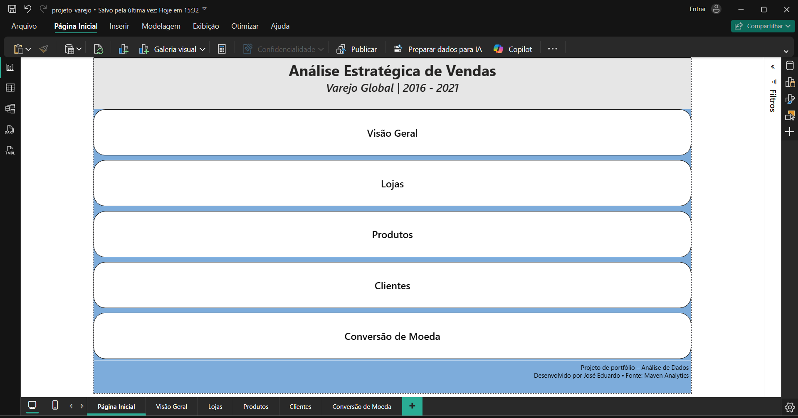
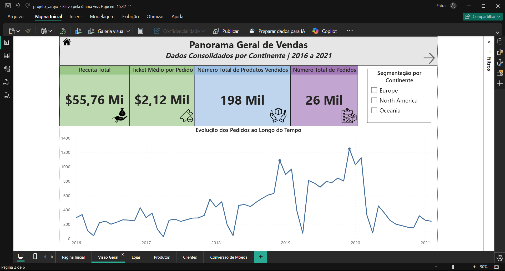
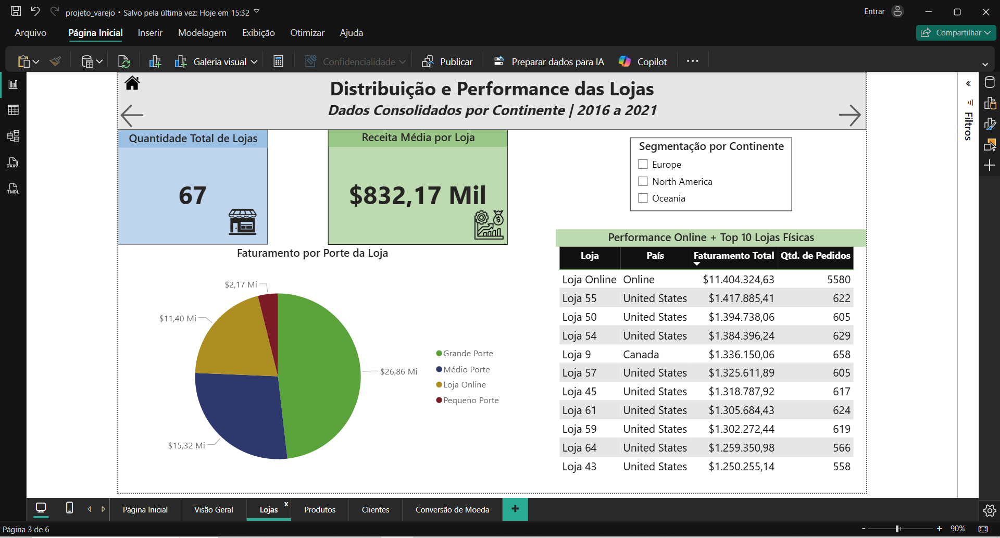
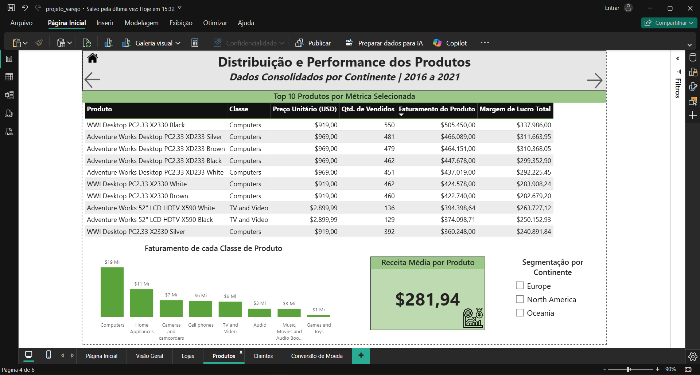
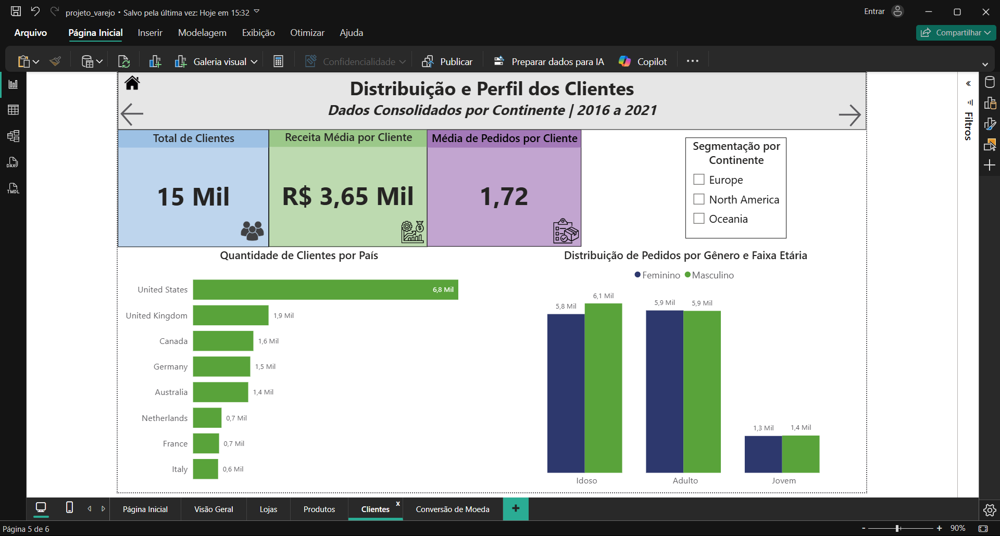
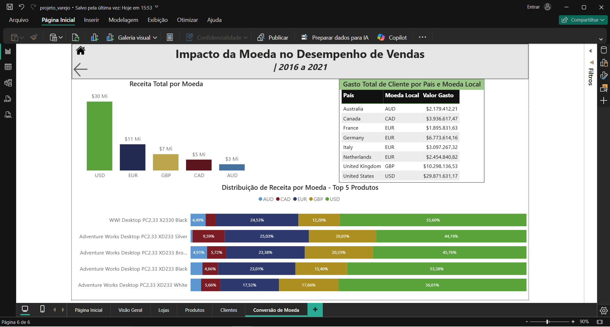

# 🛒 Painel Executivo de Vendas em Varejo - Power BI
Projeto de análise de uma rede varejista global, com foco em vendas, desempenho por loja, moedas locais e sazonalidade. Utilizei SQL para tratamento, cálculos e modelagem dos dados, e Power BI para criação de dashboards com visão gerencial e regional.

---

## 🧩 Sobre os Dados

Disponível em: [www.mavenanalytics.io/data-playground](https://www.mavenanalytics.io/data-playground)
O dataset contém cinco planilhas com dados referentes à:
- Vendas Realizadas (produto, loja, cliente)
- Clientes 
- Lojas
- Produtos
- Conversão das moedas locais para Dólar (USD)

---

## 🎯 Objetivos da Análise

- Monitorar o desempenho de vendas.
- Identificar lojas com os maiores rendimentos.
- Identificar produtos com maior volume de vendas e sua lucratividade.
- Observar as principais características do perfil do cliente.
- Analisar o desempenho geral ao longo do tempo.

---

## 📌 Principais KPIs
- 💰 Receita Total no período
- ✅ Número de pedidos e produtos
- 💰 Ticket Médio e Receita Média para cliente, produto e loja
- ✅ Número total e média de pedidos por cliente.

---

## 📈 Visões Criadas

- **Painel Geral interativo de Vendas entre 2016 e 2021**
- **Análise por Loja**
- **Análise por Produto**
- **Análise por Cliente**
- **Análise Geral levando em consideração a Moeda Local**

---

## 🛠️ Ferramentas Utilizadas

- **MySQL**
- Leitura dos arquivos CSV
- ETL para cada arquivo
- Exportação para formato CSV novamente, já com os dados tratados.

Scripts usados no MySQL: [`scripts/etl_sql.txt`](./script_SQL/scriptsql.txt)

- **Power BI Desktop**
- Power Query para colunas extras (Linguagem M)
- Medidas DAX
- Visualizações interativas

---

## 📚 Dicionário de Dados (resumo)
Este projeto usa 5 tabelas principais:

- **fVendas**: dados de pedidos, produtos, datas e moeda.
- **dClientes**: dados demográficos dos clientes.
- **dProdutos**: especificações de produtos e categorias.
- **dLojas**: localização e tamanho das lojas.
- **dConversaoMoeda**: taxa de câmbio em relação ao USD.

Para o dicionário completo, veja [aqui](./projeto_final/dicionario_varejo.txt).

---

## 📷 Preview do Dashboard

---

## 🗂️ Arquivo
[`projeto_varejo.pbix`](./projeto_varejo.pbix)

---

## 🎯 Insights Obtidos
- Os maiores picos de pedidos realizados foram nos meses de **dezembro em 2019 e 2020**.
- **Vendas Online** foram o principal pilar de receita disparado, no período analisado.
- Ainda assim, as lojas de **Grande Porte** foram responsáveis por pouco menos da metade do faturamento.
- Os produtos mais vendidos são da categoria **Computers**, se destacando tanto em volume de vendas quando em receita.
- O país que mais comprou foi disparadamente os **Estados Unidos**.
- Apesar do dólar ser a principal moeda influente na receita, o Euro e a Libra tem muita influência na venda dos produtos mais vendidos.
